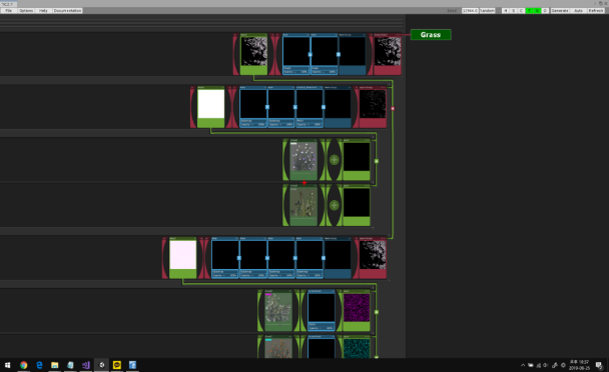
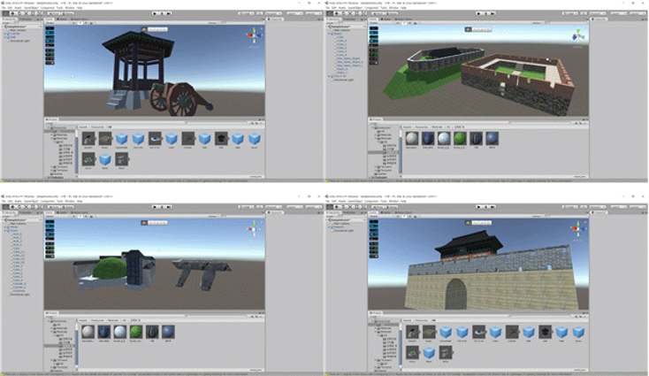
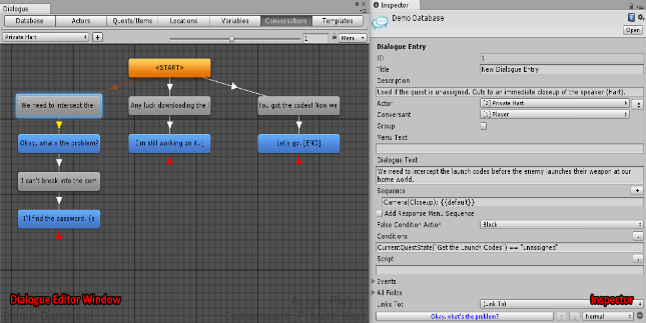
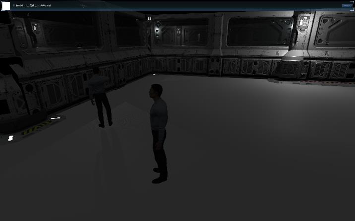

# TimeInKorea
 .

**2019 문화체육관광부 주최 문화데이터 활용 공모전 특별상 수상작**

Time In Korea는 대한민국 역사를 기반으로 한 빅데이터 기반 3D기능성 게임입니다.

# 1. 소개
[역사 게임의 효과]
- 역사 시뮬레이션 게임의 역사교육 적용 가능성에 대한 소고에 따르면 역사 시뮬레이션 게임은 학생들의 역사적 사고 발달에 기여합니다. 
- 역사 시뮬레이션 게임은 역사적 사건과 인물에 대한 추체험의 기회를 제공합니다. 
- 행복한 다람쥐단은 재미있는 역사 게임을 통해 대한민국 역사 게임을 통해 역사 인식을 높이고 역사 게임의 교육적 효과를 원하는 소비자들에게 포지셔닝 하였습니다.

[게임의 컨셉]
 역사 자료들이 해킹에 의해 조작됨을 반복하며 역사 자료를 신뢰할 수 없는 시대가 되었고, 미래공학기업에서 조상들의 기억을 엿볼 수 잇는 최첨단 기술을 개발하고 테스팅하기위해 과거로 돌아가서 탐험하는 컨셉입니다.
 
 # 2. 기술적 요소
 
 본 프로젝트는 다음과 같은 기술적 요소들을 사용하였습니다.
 
 ## 2.1. Unity
 ### 2.1.1 Terrain Compser의 활용
 앞서 World Composer를 통해 인천의 고도 정보를 담은 heightmap data를 Terrain Composer를 통해 편집 및 수정하여 게임 내 가상의 world를 구현하였습니다.
 * 지형을 자동으로 인식하여 이에 맞는 Splatmap을 적용할 수 있으며, 자동으로 적용된 Splatmap 위에 다시 자동으로 나무 object와 수풀 object를 생성한다. 물론 부족한 부분은 직접 수정할 수 있었습니다.
 * 실제 지형의 위도, 경도 및 고도 정보를 포함한 heightmap을 가져와 terrain을 생성하므로 현실과 동일한 지형을 그대로 게임 상에 구현할 수 있었습니다.
 * 실제 문화재의 위치와 게임 상의 지형 내 문화재의 위치가 완벽히 동일하며, 실제 인천 내륙, 강화도 및 도서지역의 고도가 게임 상의 지형에 그대로 구현되었습니다.

그림 Terrain Composer의 HeightMap 설계도 생성

### 2.1.2 Unity ProBuilder의 활용
* 이를 이용해 Cube부터 Cylinder, Arch, Stair 등 다양한 도형을 생성하였으며 생성한 도형들을 자유롭게 편집하여 제작하였습니다.

그림 Probuilder로 직접 모델링한 대포, 돌성, 무덤, 성문 등과 같은 유적 모델링

### 2.1.3 Dialogue System의 활용
* Dialogue Editor을 사용하여 대화 Database를 만들 대화의 Actor와 Conversant에 Unity Object를 적용시켜 상황에 따른 조건과 분기를 주었습니다.
* Quest 기능 또한 퀘스트의 항목화와 순서정리에 최적화 되어있기 때문에 이 기능을 이용하여 플레이어가 NPC 혹은 Object와 상호작용을 할 때만 다음 대화가 이루어지도록 제작하였습니다.

### 2.1.4 Photon Network의 활용
* Photon Network를 사용하여 멀티 플레이어 온라인 게임으로 제작하였습니다.

#### 2.1.5 Quest, NPC 기능
* 각 문화재마다 NPC가 잇으면 해당 NPC가 해당 문화재에 대해 설명해주도록 제작하였습니다.
* 플레이어에게 퀘스트를 제공하고 플레이어가 퀘스트를 완료하면 다음 문화재의 퀘스트를 수락할 수 있습니다.
* 플레이어는 문화재를 구경하다 npc의 설명과 퀘스트를 헤결하다보면  문화재에 대한 역사적배경 및 사건과 같은 역사적 지식을 습득가능하도록 하였습니다.

